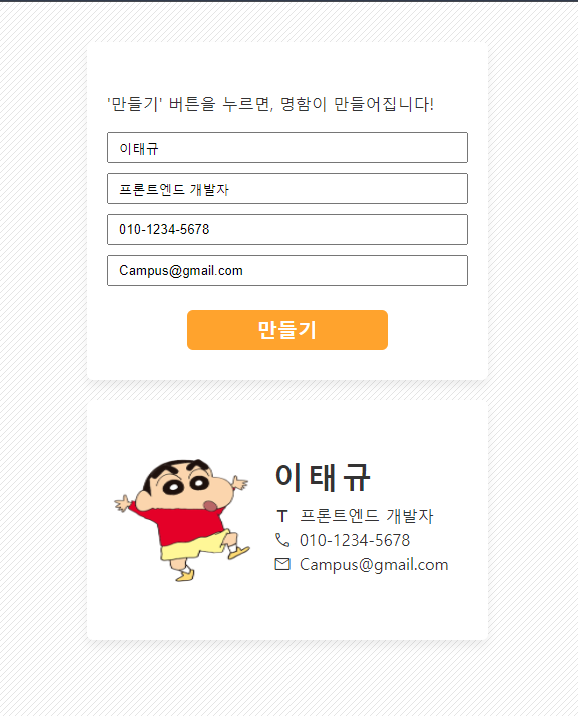

# 💻 Frontend Development Practice
> **패스트캠퍼스 실습: 웹 기술을 활용한 UI/UX 컴포넌트 구현**

본 리포지토리는 패스트캠퍼스 프론트엔드 강의를 수강하며 진행한 컴포넌트 설계, 레이아웃 자동화 및 시각화 실습 코드와 결과물을 정리한 공간입니다.

---

## 🖼️ Implementation Result (명함 UI 구현)
강의를 통해 학습한 마크업 및 스타일링 기술을 활용하여 제작한 디지털 명함 컴포넌트입니다.

*프론트엔드 기술을 활용한 커스텀 명함 UI 레이아웃 구현*

---

